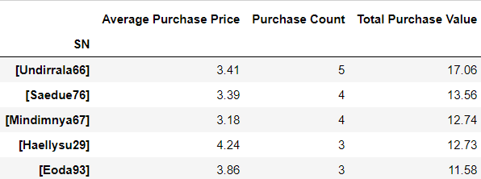

## Purchase Data Analysis using Python-Pandas
**Objective:**
Deep dive into the purchase data for the fantasy game ‘Heroes of Pymoli’ launched by an Independent gaming company and provide them with useful business insights to improve revenues and create market differentiation.

Like many others in its genre, the game is free-to-play, but players are encouraged to purchase optional items that enhance their playing experience.

**Observable Trends and Conclusions Derived:**
  * Of the 1163 active players, the vast majority are male (80%). There also exists, a smaller, but notable proportion of female players (17%).
  *	Our peak age demographic falls between 20-24 (42%) with secondary groups falling between 15-19 (17.80%) and 25-29 (15.48%).
  * Our players are putting in significant cash during the lifetime of their gameplay. Across all major age and gender demographics, the average purchase for a user is roughly $493.

**Programming language used:** Python-Pandas library for Data Munging and Data Analysis
**Tools Used:** Jupyter Notebook 

Generated a report that breaks down the game's purchasing data into meaningful insights.
The final report contains each of the following:

**Player Count**
* 

**Purchasing Analysis (Total)**
* 

**Gender Demographics**
* 

**Purchasing Analysis (Gender)** 
* 

**Age Demographics**
* 

**Top Spenders**
* Identified the top 5 spenders in the game by total purchase value, then listed (in a table):
  
  
**Most Popular Items**
* Identified the 5 most popular items by purchase count, then listed (in a table):
 
 
**Most Profitable Items**
* Identified the 5 most profitable items by total purchase value, then listed (in a table):
 
